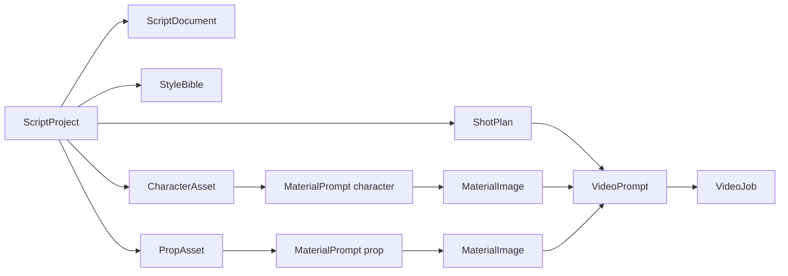
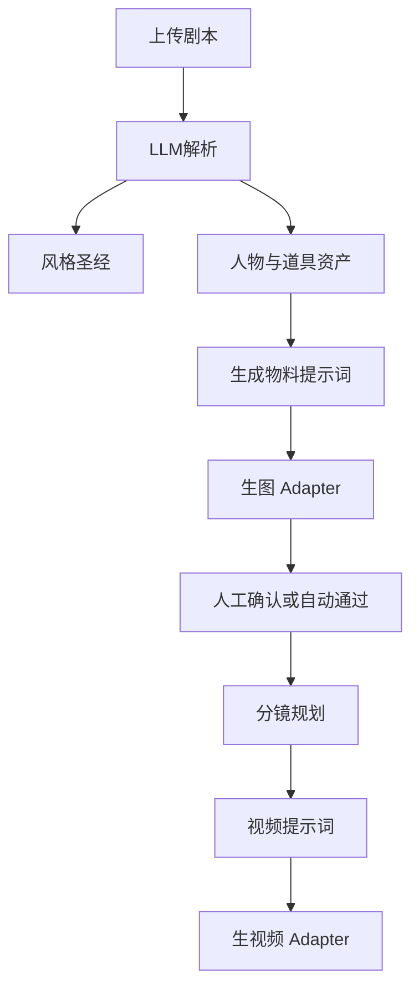

# 剧本物料业务层设计

> 垂直业务：剧本解析 → 物料提示词 → 物料图 → 视频提示词（→ 视频）。  
> 复用现有 AI 平台的鉴权、租户、模型配置、对象存储与审计；不改动平台内核边界。  
> 模型：对齐参考仓库 `sd-2-c`（本地只读克隆于 `.ref/sd-2-c`，不入库）。  
> Chat / 解析：`/chat/completions`；生图：Seedream `/images/generations`；生视频：Seedance `/contents/generations/tasks`。

## 1. 目标与边界

**做什么**

1. 上传/登记剧本，解析出风格、人物、道具（按归属拆分）。
2. 为每个人物、每件「归属+物品」生成风格统一的物料提示词。
3. 用物料提示词生成物料图，并沉淀为一致性资产。
4. 结合用户剧本 + 物料图，生成分镜级视频提示词；再调用生视频（Adapter）。

**不做什么（本期）**

- 不在本业务里重做通用 RAG/Agent 平台能力。
- 不替代剪辑软件；只产出提示词、图片、视频文件与溯源。
- 不在文档或仓库中保存真实 API Key。

**落位（已确认默认）**

- 垂直业务包：`packages/business_script` + `apps/api` 下业务路由前缀 `/api/v1/script-biz`
- 管理端增加「剧本工坊」菜单（React）
- 生图/生视频：Adapter 接口先定契约，对接方舟（参考内部项目 sd-2-c / Seedance 链路）

---

## 2. 核心一致性规则

| 规则 | 说明 |
|------|------|
| 风格统一 | 全剧提取 `style_bible`（时代、画风、色调、镜头语言），所有物料/视频提示词必须引用 |
| 人物一致 | 每人一个 `CharacterAsset`，固定外貌锚点（脸、发、体型、着装基线）；后续分镜只增量描述动作/表情 |
| 道具一致 | 道具实体键 = `owner_character_id + prop_type + prop_name`；同一人同一物全程复用锚点 |
| 归属拆分 | 「甲的手机」与「乙的手机」是两个 `PropAsset`，禁止合并为通用「手机」 |
| 无主公物 | 场景公有物（如「会议室白板」）`owner_character_id` 为空，用 `scope=scene` |

实体唯一键建议：

```text
character_key = normalize(剧本内人物名)
prop_key      = f"{owner_key or '_scene'}::{prop_type}::{normalize(prop_name)}"
```

---

## 3. 领域模型



### 3.1 表逻辑（业务库，仍落 MySQL，带 tenant_id）

| 实体 | 关键字段 |
|------|----------|
| `script_project` | id, tenant_id, name, status, style_bible(json), created_at |
| `script_document` | id, project_id, title, raw_text/uri, version, parse_status |
| `character_asset` | id, project_id, name, character_key, appearance_anchor, personality_tags, status |
| `prop_asset` | id, project_id, owner_character_id(nullable), prop_key, prop_type, prop_name, visual_anchor, status |
| `material_prompt` | id, project_id, target_type(character/prop), target_id, prompt_text, negative_prompt, style_ref, version, status |
| `material_image` | id, prompt_id, oss_uri, provider, seed, width, height, status, request_id |
| `shot_plan` | id, project_id, ordinal, scene_text, beat, character_ids[], prop_ids[], camera |
| `video_prompt` | id, shot_id, prompt_text, ref_image_ids[], duration_sec, status |
| `video_job` | id, video_prompt_id, provider_job_id, oss_uri, status, error_message |

解析中间结果可进 `script_document.parse_result(json)`，不必过早拆过多表。

---

## 4. 流水线



### 4.1 阶段 A：剧本解析（Chat = DeepSeek on Ark）

输入：剧本全文或分场文本。  
输出 JSON（强制 schema）：

```json
{
  "style_bible": {
    "era": "",
    "visual_style": "",
    "color_palette": [],
    "tone": "",
    "camera_language": ""
  },
  "characters": [
    {
      "name": "甲",
      "appearance": "外貌锚点...",
      "costume_baseline": "着装基线...",
      "notes": ""
    }
  ],
  "props": [
    {
      "name": "手机",
      "prop_type": "electronics",
      "owner": "甲",
      "visual": "黑色直板机、细划痕...",
      "scope": "owned"
    },
    {
      "name": "手机",
      "prop_type": "electronics",
      "owner": "乙",
      "visual": "银色折叠屏...",
      "scope": "owned"
    }
  ],
  "scenes": [{"name": "咖啡馆", "summary": "..."}]
}
```

校验：

- 同名人物合并；别名映射到同一 `character_key`
- `owner` 必须能关联到人物，否则标 `needs_review`
- 相同 `prop_key` 合并视觉描述（取更具体者），不新建重复资产

### 4.2 阶段 B：物料提示词

对每个 Character / Prop 调 Chat，模板固定章节：

1. 风格锁定（注入 `style_bible`）
2. 主体锚点（人物外貌 / 道具归属+外观）
3. 拍摄设定（白底/三视图/角色定妆等，按资产类型）
4. 一致性约束句（禁止改脸、改主色、改 Logo）
5. negative prompt

输出写入 `material_prompt`，并带 `version`；重生只增版本，旧版可回滚。

### 4.3 阶段 C：物料生图（Ark Image Adapter）

- 入参：`material_prompt` + 可选上版图（img2img / 参考图，若方舟接口支持）
- 出参：OSS 路径 + seed + 供应商任务号
- 成功后资产状态 `ready`；失败可重试，不覆盖已人工确认的图

### 4.4 阶段 D：视频提示词 + 生视频

对每个 `shot_plan`：

1. 取场次文本、出场人物图、出场道具图
2. Chat 生成 `video_prompt`：动作、镜头、时长、对白要点，并引用物料图 ID
3. 调 Ark Video Adapter（对接 sd-2-c 同类能力）生成视频
4. 全程写 `request_id` / `run_trace`（`run_type=script_biz`）

---

## 5. 与 sd-2-c 的对接映射

参考实现路径：`.ref/sd-2-c/backend/app/services/`（只读对照，业务代码先 copy 再改写，避免重复造轮子）。

| 本业务能力 | sd-2-c 服务 | 方舟端点 | 默认模型 |
|------------|-------------|----------|----------|
| 剧本解析 / 物料提示词 / 视频提示词 | `doubao_chat_service.py` | `POST {ark}/chat/completions` | `deepseek-v4-flash-260425`（你方指定；原项目为 doubao endpoint） |
| 物料生图 | `seedream_service.py` | `POST {ark}/images/generations` | `doubao-seedream-5-0-260128`（需配置 `SEEDREAM_ENDPOINT_*` 接入点） |
| 视频生成 | `seedance_service.py` | `POST {ark}/contents/generations/tasks` | `doubao-seedance-2-0-260128` |
| 分镜角色/道具提取结构 | `doubao_chat_service.SYSTEM_PROMPT` 中 `roles[]`（character/prop/product/scene） | 同上 Chat | 同上 |
| 一致性文案模板 | `storyboard_prompts.py`（定妆/多视角等） | — | — |

关键约定（从 sd-2-c 继承）：

- 统一 `ARK_API_BASE=https://ark.cn-beijing.volces.com/api/v3`，`Authorization: Bearer {ARK_API_KEY}`
- 生图 `model` 字段传 **接入点 endpoint_id**，不是展示名
- 生视频 `content` 为多模态列表：`text` + `image_url`(role=reference_image) + 可选 `video_url`
- 视频异步：创建任务后轮询 `GET .../contents/generations/tasks/{id}`
- 归属道具：在解析 schema 中强制 `owner`；映射到 sd-2-c 的 `role_type=prop` 时，`role_name` 使用 `甲的手机` 这类带归属名，避免合并

## 6. 与现有 AI 平台的关系

| 能力 | 复用 |
|------|------|
| 租户 / JWT / 审计 | 原样 |
| 模型登记 | Chat 登记为 `openai_compatible`，`base_url=ARK/v3`，`model_name=deepseek-v4-flash-260425` |
| OSS | 剧本原件、物料图、视频 |
| MQ | 解析、生图、生视频异步任务 |
| LangChain 核心 | 后续把解析/提示词生成放进 `packages/core` runnable；业务包只编排领域状态机 |

业务包依赖方向：

```text
business_script → governance / adapters / infra
（禁止反向依赖）
adapters 内 Seedream/Seedance/Chat：从 sd-2-c 对应 service copy 后改写入 packages/adapters
```

---

## 7. API 草案（业务前缀）

| 方法 | 路径 | 说明 |
|------|------|------|
| POST | `/script-biz/projects` | 创建项目 |
| POST | `/script-biz/projects/{id}/scripts` | 上传剧本 |
| POST | `/script-biz/projects/{id}/parse` | 触发解析 |
| GET | `/script-biz/projects/{id}/assets` | 人物/道具列表 |
| POST | `/script-biz/projects/{id}/material-prompts/generate` | 批量生成物料提示词 |
| POST | `/script-biz/material-prompts/{id}/images` | 生图 |
| POST | `/script-biz/projects/{id}/shots/plan` | 分镜规划 |
| POST | `/script-biz/shots/{id}/video-prompts/generate` | 视频提示词 |
| POST | `/script-biz/video-prompts/{id}/render` | 生视频 |
| GET | `/script-biz/jobs/{id}` | 异步任务状态 |

---

## 8. 提示词策略（摘录）

**人物物料（定妆）**  
「基于风格圣经 {style}，生成角色定妆图提示词。必须锁定：{appearance_anchor}。禁止改变脸型与发色。输出正面半身、中性表情、干净背景。」

**归属道具**  
「道具归属：{owner_name}。道具标识：{prop_key}。外观锚点：{visual_anchor}。必须与剧本风格 {style} 一致。画面中可出现归属暗示（如壳上字母），但不要出现其他角色。」

**视频提示词**  
「分镜 #{n}：{beat}。出镜角色图：{char_image_refs}。出镜道具图：{prop_image_refs}。动作与镜头：…。保持人物与道具外观与参考图一致，不得互换甲乙私人物品。」

---

## 9. 配置（本地 .env，勿提交）

生图 / 生视频走赏舞（sd-2-c）开放 API。  
Key 用法见 [02-sd-api-key-and-calls.md](./02-sd-api-key-and-calls.md)；完整 `SD_*` 配置见 [03-sd-config.md](./03-sd-config.md)。

```text
SD_ENABLED=true
SD_BASE_URL=http://115.191.32.99:8080
SD_API_KEY=sk-***
SD_IMAGE_MODEL=doubao-seedream-5-0-260128
SD_VIDEO_MODEL=doubao-seedance-2-0-260128
# 画幅 / 轮询 / 视频 / 人像等见 03-sd-config.md
```

剧本解析 / 提示词仍用本平台 Chat 模型配置（与 `SD_*` 无关）。

---

## 10. 分期

**B0（设计已覆盖，下期实现）**

- 项目/剧本/解析 JSON
- 人物与归属道具资产
- 物料提示词生成与人工可编辑

**B1**

- 物料生图、分镜、视频提示词
- 方舟 Image/Video Adapter

**B2**

- 一致性自动质检（人脸/道具相似度）
- 批量重生成、版本对比、导出分镜包

---

## 11. 验收标准（B0）

- 解析结果中，甲手机与乙手机为两条 `prop_asset`
- 每个人物/道具都能生成带 `style_bible` 引用的物料提示词
- 提示词与资产版本可追溯到 `script_document.version`
- 密钥不出现在 API 响应、日志、设计文档正文
