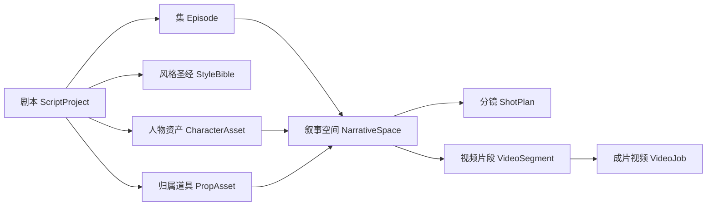

# 叙事空间与双模式交互（目标产品形态）

> 本文定义剧本工坊的目标产品形态，是领域与交互决策的唯一依据。  
> 实施顺序与验收见 [05-dev-roadmap.md](./05-dev-roadmap.md)。  
> 框架侧 Agent 运行时见 [../../framework/agent_apps/README.md](../../framework/agent_apps/README.md)；设计备忘见 [../../framework/design/08-agent-framework-pivot.md](../../framework/design/08-agent-framework-pivot.md)。

本文固定两件事：

1. **内容维度**收敛为「剧本 → 集 → 叙事空间 → 视频片段」，分镜挂在叙事空间上；叙事空间是编辑 / 画布 / 知识库单位，视频片段是生视频单位；
2. **交互形态**提供画布模式与 Agent 对话模式两个入口，二者共用同一套工具与领域模型。

本期只做解说漫叙事链路；**不做带货（commerce）**，不保留 `content_type` 分派机制。

## 1. 为什么需要叙事空间

若从项目直接挂到分镜，会出现：

| 现象 | 问题 |
|------|------|
| 没有「集」 | 短剧按集分发、排期、验收，无法表达交付批次 |
| 没有可交付中间单位 | 分镜是镜头级描述；项目是整部剧，粒度过大 |
| 视频挂在分镜上 | 用户拿到几秒碎片，仍需自行拼接 |
| 画布无边界 | 数百个分镜落在单画布上无法导航 |

结论：需要一个既是语义编辑单位、又是检索单位的中间层——**叙事空间**；成片与画布则落在 **视频片段（≤15s）**。

## 2. 内容维度：五级模型



| 层级 | 实体 | 数量关系 | 职责 |
|------|------|----------|------|
| 剧本 | `script_project` | 1 | 全剧唯一的风格圣经与人物 / 道具锚点归属层 |
| 集 | `episode` | 每剧 N 集 | 交付批次、排期与验收单位 |
| **叙事空间** | `narrative_space` | 每集 N 个 | 语义完整的一场戏；**语义编辑单位 = 知识库单位**；长度不设限；切分规则见 2.1 |
| 分镜 | `shot_plan` | 每叙事空间 N 个 | 镜头级描述：景别、动作、镜头语言，是视频提示词的输入素材 |
| **视频片段** | `video_segment` | 每叙事空间 N 个 | 连续若干分镜的分组；**成片单位 = 画布单位**，单段不超过模型上限（≤15s）；见 D1 / D2 |

### 2.1 叙事空间怎么切

叙事空间是**语义单元**，回答的是「这是不是同一场戏」，不回答「能不能一次生成出来」。后者是视频片段的职责。

叙事空间**不是**剧本里的节奏标签。下列标签只表示一集内的叙事起承转合，**禁止**当作叙事空间边界：

- `[开头Hook First]`
- `[中间Escalation]`
- `[结尾Cliffhanger]`

切分分两步。第一步规则粗切，只看字面信号：

| 条件 | 含义 |
|------|------|
| **场景变化** | 地点 / 时空发生切换（如公寓 → 酒店套房、办公室 → 后巷） |
| **画面变化（转场）** | 出现明确的转场、切镜换场词 |

第二步由 `narrative-segmenter` Agent 逐集判定语义边界（见 D6）。粗切只认字面信号，常把一场戏切开、或把两场戏粘在一起，需要主观判断补上：

| 构成边界 | 不构成边界 |
|----------|------------|
| 地点 / 时空切换 | 说话的人换了 |
| 画面无法无缝接续 | 同场戏内的停顿、留白、内心独白 |
| 戏的目的变了：对峙结束、揭露完成、关系不可逆转折 | 节奏标签 |
| 情绪基调实质变化 | 段落变长 |

**时长不参与叙事空间切分。** 一段戏演满一分钟仍是一个叙事空间，成片由视频片段层再分段。

### 2.2 叙事空间的三重身份

| 身份 | 含义 |
|------|------|
| **编辑单位** | 一个叙事空间对应一个画布，组织分镜与物料 |
| **检索单位** | 知识库按叙事空间入库，一条带集号 / 空间号 / 地点 / 节拍，命中可定位到具体场次 |
| **导航单位** | 剧本 / 集 / 叙事空间三级目录树的叶子 |

成片不在这一层：一个叙事空间聚合产出**一到多段**成片视频，逐段挂在视频片段上（见 D1）。

### 2.2.1 视频片段怎么切

由 LLM 按**分镜内容**判定边界：哪几个连续分镜是一次运镜能连贯拍完的，就编成一个片段。地点跳转、时间跳跃、情绪反转、动作主体切换处必须断开；一个完整动作或一次完整交锋不拆到两个片段。

模型单次生成上限（当前 **15 秒**）只作天花板校验，不用来累加凑数：某组多镜合计超限即判编组无效，直接失败；单个分镜本身超上限时独立成段，由下游按上限截断。

编组只在分镜规划完成后进行；重新编组会清掉该空间下未确认的成片提示词，因为镜头组变了旧提示词就对不上。

### 2.3 一致性锚点的归属层级

| 资产 | 归属层级 | 跨叙事空间行为 |
|------|----------|----------------|
| `style_bible` 风格圣经 | 剧本级 | 全剧共享，所有物料与视频提示词强制引用 |
| `character_asset` 人物 | 剧本级 | 跨集跨空间复用同一外貌锚点 |
| `prop_asset` 归属道具 | 剧本级 | 实体键 `owner_key::prop_type::normalize(prop_name)`，全程不合并 |
| `costume_change` 造型服装 | 角色 × 集 × 叙事空间 | 按空间变化，引用人物锚点做增量描述 |
| `shot_plan` 分镜 | 叙事空间级 | 不跨空间 |

画布内的人物 / 道具节点是对剧本级资产的**引用**而非拷贝。

### 2.4 一致性规则（硬约束）

| 规则 | 说明 |
|------|------|
| 风格统一 | 全剧一份 `style_bible`（时代、画风、色调、镜头语言） |
| 人物一致 | 每人一个 `CharacterAsset`，固定外貌锚点；分镜只增量描述动作 / 表情 |
| 道具一致 | 道具实体键 = `owner + prop_type + prop_name`；同一人同一物全程复用锚点 |
| 归属拆分 | 「甲的手机」与「乙的手机」是两个 `PropAsset`，禁止合并 |
| 无主公物 | 场景公有物 `owner_character_id` 为空，`scope=scene` |
| AI / 确认分离 | 重跑只清理 `record_status=ai`；`confirmed` 永不覆盖（D5） |

实体唯一键：

```text
character_key = normalize(剧本内人物名)
prop_key      = f"{owner_key or '_scene'}::{prop_type}::{normalize(prop_name)}"
```

## 3. 双模式交互

同一个叙事空间同时暴露两个入口，共用同一份数据与同一套工具。

### 3.1 画布模式

复用赏舞 2.0（`sd-2-c`）的 React Flow 无限画布，先 copy 再改写。

- **节点**：分镜、引用的人物 / 道具 / 物料图，汇聚到一个**成片视频输出节点**
- **连线**：产物依赖图 `人物 → 物料图 → 多个分镜 → 叙事空间成片视频`
- **交互**：节点上触发单节点生成或重跑；服务端快照持久化布局
- **适用**：逐项审核迭代的精修场景

### 3.2 对话模式

- 用户对 coordinator 说明目标，例如「把第 3 集第 2 个叙事空间出成一段成片」
- coordinator handoff 给 `parser` / `asset-planner` / `shot-planner` / `media`
- 轨迹经 SSE `event: step` 推送，同步到画布节点状态
- **适用**：目标明确、愿意让 Agent 决定调用顺序的批量场景

### 3.3 统一约束

**画布上的每个「生成」按钮，就是对话里 LLM 调用的那个工具。**

差异只在最外层：**谁决定调用顺序**。工具函数、依赖解析、幂等与状态规则完全共享。

## 4. 关键决策

### D1 视频生成粒度是视频片段，不是分镜，也不是叙事空间

分镜是镜头级**描述**单位，不是**交付**单位；叙事空间是语义单位，长度不受模型约束。二者中间需要一个承接模型物理上限的层：**视频片段**。

一个视频片段下的连续分镜 + 物料图 + 人物 / 道具锚点聚合为**一段**视频提示词，调用一次生视频。`video_prompt` 挂 `video_segment_id`（冗余保留 `narrative_space_id` 便于按空间聚合），`video_job` 挂 `video_prompt_id`。

早期版本让叙事空间直接承担成片单位，导致 15 秒上限倒灌进语义切分，一集被切成十几个碎片。现在时长约束只作用在视频片段层。

### D2 视频片段（≤15s）是画布的唯一承载单位

叙事空间只负责语义切分与知识检索；画布挂在视频片段上，与成片一一对应。

| 否决方案 | 原因 |
|----------|------|
| 一个剧本一个画布 | 数百分镜无法导航，跨集混杂 |
| 一个叙事空间一个画布 | 长空间可含多段成片，画布与生成单元错位 |
| 一个分镜一个画布 | 过碎；人物 / 道具依赖被切散 |

### D3 两种模式共用工具，不写两套实现

禁止为画布单独写流水线编排。画布「生成」直接调工具函数；对话经 `tool_calls` 调同一函数。

### D4 画布连线即依赖图

依赖关系在工具声明中单一定义；画布渲染读它，orchestrator 执行读它。

### D5 AI 产物与人工确认分离

重跑只清理 `record_status=ai`；人工已确认永不覆盖。两种模式一致。

确认即定版：定版后仍可修改，改动前把当前内容快照进废稿历史，可随时反悔写回。
不设审批流（无提交 / 审核 / 退回），状态只有 `ai` / `confirmed`。
机制详见 [06-material-library-adoption.md 第 5 节](./06-material-library-adoption.md#5-新锁定决策定版--废稿历史--反悔)。

### D6 集边界用规则，叙事空间与片段边界用 LLM

集边界、行类型分类、元数据提取由正则与规则完成，稳定且零成本。支持输入：`txt` / `md` / `docx` / `fdx`。集边界从稿面标记识别（如 `剧集 [N]`）。

叙事空间边界是主观判断：「这两段是不是同一场戏」没有可靠的字面信号，规则粗切只能当基线。由 `narrative-segmenter` Agent 逐集判定，**不得**用 Hook / Escalation / Cliffhanger 切空间。

为防止模型改写原文，交互协议约定：

| 方向 | 内容 |
|------|------|
| 送入 | 集元数据 + 规则粗切基线 + **编号后的正文段落** |
| 返回 | 每个空间的**起止段号** + 标题 / 地点 / 时空 / 梗概 / 节拍 / 氛围 / 断开理由 |

正文由服务端按段号重组，模型不接触正文写入路径。段号必须连续覆盖全集，出现重叠、跳段或遗漏直接判失败，不做兜底切分。

视频片段的编组同样是主观判断，走 LLM，协议与上表同构：送入叙事空间信息 + 编号后的分镜清单（含各镜时长），返回**起止镜号** + 标题 / 梗概 / 编组理由，正文与时长由服务端按镜号重算。镜号必须连续覆盖全部分镜，越界、跳镜或某组合计超过时长上限直接判失败（见 2.2.1）。

## 5. 七类结构化数据的落位

| 类别 | 落位 | 说明 |
|------|------|------|
| 人物设定 | `character_asset` | 剧本级，含外貌锚点与着装基线 |
| 分级道具场景资产 | `prop_asset` | 含 `scope=scene` 的无主公物 |
| 角色和资产清单 | 查询聚合 | 不建表 |
| 角色造型与服装变化 | `costume_change` | 角色 × 集 × 叙事空间 |
| 双语对照 | `bilingual_line` | 挂叙事空间 |
| 多维标签 | `content_tag` | 可挂剧本 / 集 / 叙事空间 |
| 分镜脚本 | `shot_plan` | 挂叙事空间 |

每类为独立工具函数，可单独重跑，依赖由 orchestrator 解析。

## 6. 领域表

### 6.1 已有 / 目标表

| 实体 | 关键字段 | 状态 |
|------|----------|------|
| `script_project` | id, tenant_id, name, status, style_bible | 已落地（无 content_type） |
| `script_document` | id, project_id, raw_text, version, parse_status, source_* | 已落地 |
| `character_asset` / `prop_asset` / `material_prompt` | 含 `record_status` | 已落地 |
| `episode` | id, project_id, ordinal, title, status, record_status | 已落地 |
| `narrative_space` | id, episode_id, ordinal, title, summary, time_place, source_text, beat_type, mood, boundary_reason, segment_source, status, record_status | 已落地 |
| `video_segment` | id, narrative_space_id, ordinal, title, shot_ids, source_text, duration_sec, status, record_status | 已落地 |
| `shot_plan` | id, narrative_space_id, ordinal, beat, camera, … | 已落地 |
| `canvas_snapshot` | id, video_segment_id, nodes, edges, viewport, version | 已落地：一片段一画布 |
| `costume_change` / `bilingual_line` / `content_tag` | 见上节 | `costume_change` 表已建，抽取未做 |
| `material_image` | prompt_id, oss_uri, provider, seed, status | 已落地 |
| `video_prompt` | video_segment_id, narrative_space_id, prompt_text, ref_image_ids, duration_sec, status | 已落地 |
| `video_job` | video_prompt_id, video_segment_id, provider_job_id, oss_uri, status | 已落地 |

### 6.2 挂载关系（相对旧扁平模型）

| 实体 | 挂载 |
|------|------|
| `shot_plan` | `narrative_space_id`（不是直挂 project） |
| `video_segment` | `narrative_space_id`；`shot_ids` 记录聚合了哪些分镜 |
| `video_prompt` | `video_segment_id`（不是 `shot_id`，也不再是 `narrative_space_id`） |
| `video_job` | 仍挂 `video_prompt_id`；一片段一任务 |

### 6.3 工作台与知识库职责

| 层 | 职责 | 是否唯一事实 |
|----|------|-------------|
| 工作台 DB | `style_bible` / `character_asset` / `scene_space` / `costume_change` / 确认状态 / 参考图指针 | **是** |
| 项目知识库 `script/project/{project_id}` | 叙事空间 + 人物 + 场景的可重建检索副本 | 否 |
| 工艺知识库 `script/craft/*` | prompting / cinematography / visual-style / consistency 规范 | 否（规范） |

生成前组装 **ConsistencyPack**（DB 事实 + 可选工艺规范），冲突时以工作台 confirmed 资产为准，知识库不得覆盖。

项目索引覆盖写入：叙事空间 / 人物 / 场景各一条文档，payload 带 `doc_type` 与源记录 id / `record_status` / `source_updated_at`。上传时不盲切；结构切分与资产就绪后单独触发。删除项目时同步清理项目向量命名空间。

## 7. 落地顺序

以 [05-dev-roadmap.md](./05-dev-roadmap.md) 为准。原则：**先立维度，再改粒度，最后做入口**；生图生视频前必须先有任务化。

| 阶段 | 摘要 |
|------|------|
| 一 | 清障（删 legacy KB、撤 commerce/content_type）+ Alembic 接管剧本表 |
| 二 | 规则结构解析 + 分镜服务 + video_prompt 挂叙事空间 + 剩余表 |
| 三 | 作业表 / Worker / 轮询 |
| 四 | 赏舞薄客户端 + 成本预估 |
| 五 | 画布模式 + 双模式状态同步 |

## 8. 与平台 / 赏舞的边界

| 能力 | 归属 |
|------|------|
| 租户 / JWT / 审计 / OSS | 平台原样复用 |
| Chat / 工艺知识检索 | 平台能力；业务经 `knowledge_context` 装配，不把整条流水线塞进 ReAct |
| 生图 / 生视频 | 赏舞开放 API（`SD_*`），本仓只做薄客户端 |
| 业务状态与资产 | `business/script` + MySQL |

依赖方向：`business.script → framework.governance / framework.adapters / framework.infra`（禁止反向）。

## 9. 明确不做

- 不做带货 / commerce / product 替换 / `content_type` 分派
- 不做剧本级 / 叙事空间级 / 分镜级画布（D2：仅视频片段画布）
- 不做分镜级成片视频（D1）
- 不为画布单独实现一套编排（D3）
- 不做画布内时间轴剪辑
- 不做两种模式之间的迁移向导
- 不用 LLM 切集边界（D6）
- 不做视频片段之间的自动拼接与转场渲染
