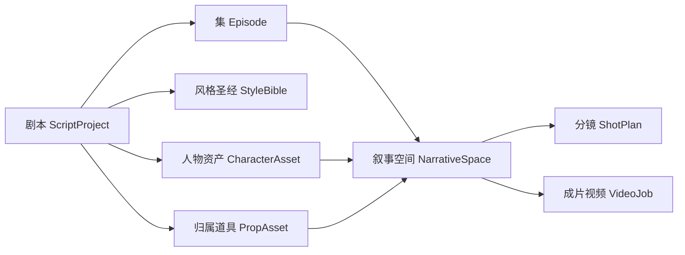

# 叙事空间与双模式交互（目标产品形态）

> 本文定义剧本工坊的目标产品形态，包含两件事：
>
> 1. **内容维度**收敛为「剧本 → 集 → 叙事空间 → 分镜」四级，叙事空间同时是画布承载单位与生视频单位；
> 2. **交互形态**提供画布模式与 Agent 对话模式两个入口，二者共用同一套工具与领域模型。
>
> 本文的决策**优先于** [01-domain-design.md](./01-domain-design.md) 中冲突的部分，冲突清单见第 8 节。
> 框架侧的 Agent 运行时、工具循环、多 Agent handoff 见 [../enterprise-langchain/08-agent-framework-pivot.md](../enterprise-langchain/08-agent-framework-pivot.md)，本文不重复。

## 1. 现状诊断

[01-domain-design.md](./01-domain-design.md) 建立的领域模型是 `ScriptProject → ScriptDocument → ShotPlan`，从项目直接下到分镜。这个结构在两个位置不成立：

| 现象 | 位置 | 问题 |
|------|------|------|
| 没有「集」这一层 | `script_project` / `shot_plan` | 短剧按集分发、按集排期、按集验收，缺这一层则无法表达交付批次 |
| 没有可交付的中间单位 | `shot_plan` 直挂 project | 分镜是镜头级描述，不是可审看单位；项目是整部剧，粒度过大 |
| 视频挂在分镜上 | `video_prompt.shot_id` | 一个分镜出一段几秒视频，用户拿到的是碎片，仍需自行拼接 |
| 画布无承载边界 | 未定义 | 一部剧数百个分镜落在单画布上会退化成无法导航的节点海 |

结论：缺的不是表，而是**一个既是编辑单位、又是成片单位、又是画布单位的中间层**。这一层即「叙事空间」。

## 2. 内容维度：四级模型

| 层级 | 实体 | 数量关系 | 职责 |
|------|------|----------|------|
| 剧本 | `script_project` | 1 | 全剧唯一的风格圣经与人物 / 道具锚点归属层 |
| 集 | `episode` | 每剧 N 集 | 交付批次、排期与验收单位 |
| **叙事空间** | `narrative_space` | 每集 N 个 | 一段连续叙事（粗略对应传统剧本的一场戏）；**画布单位 = 成片单位** |
| 分镜 | `shot_plan` | 每叙事空间 N 个 | 镜头级描述：景别、动作、镜头语言，是视频提示词的输入素材 |

### 2.1 叙事空间的三重身份

叙事空间之所以是这套模型的轴心，在于三个单位在它这里重合：

| 身份 | 含义 |
|------|------|
| **编辑单位** | 一个叙事空间对应一个画布，用户在其中组织分镜与物料 |
| **生成单位** | 一个叙事空间聚合产出**一段成片视频**（见 D1） |
| **导航单位** | 剧本 / 集 / 叙事空间三级构成左侧目录树，叙事空间是叶子 |

三者重合带来的收益是：用户在一个画布内完成的工作，恰好等于一个可独立审看、可独立重做的交付物。跨画布协调与画布内碎片化都不会发生。

### 2.2 一致性锚点的归属层级

| 资产 | 归属层级 | 跨叙事空间行为 |
|------|----------|----------------|
| `style_bible` 风格圣经 | 剧本级 | 全剧共享，所有物料与视频提示词强制引用 |
| `character_asset` 人物 | 剧本级 | 跨集跨空间复用同一外貌锚点 |
| `prop_asset` 归属道具 | 剧本级 | 实体键 `owner_key::prop_type::normalize(prop_name)`，全程不合并 |
| `costume_change` 造型服装 | 角色 × 集 × 叙事空间 | 按空间变化，引用人物锚点做增量描述 |
| `shot_plan` 分镜 | 叙事空间级 | 不跨空间 |

因此画布内的人物 / 道具节点是对剧本级资产的**引用**而非拷贝：在任一叙事空间修正人物锚点，全剧一致生效。这是「跨集视觉不漂移」的实现基础。

## 3. 双模式交互

同一个叙事空间同时暴露两个入口，共用同一份数据与同一套工具。

### 3.1 画布模式

复用赏舞 2.0（`sd-2-c`）的 React Flow 无限画布组件，先 copy 再改写。

- **节点**：分镜、引用的人物 / 道具 / 物料图，最后汇聚到一个**成片视频输出节点**
- **连线**：即产物依赖图 `人物 → 物料图 → 多个分镜 → 叙事空间成片视频`
- **交互**：在节点上直接触发单节点生成或重跑；Web Worker 承载画布内草稿计算；服务端快照持久化布局与撤销栈
- **适用**：需要逐项审核迭代的精修场景

### 3.2 对话模式

- 用户对 coordinator Agent 说明目标，例如「把第 3 集第 2 个叙事空间出成一段成片视频」
- coordinator 通过 handoff 委派给 `parser` / `asset-planner` / `shot-planner` / `media` 四个 specialist 分工完成
- 运行轨迹通过 SSE `event: step` 实时推送，同步反映为对应画布的节点状态变化
- **适用**：目标明确、愿意让 Agent 自主决定调用顺序的批量场景

### 3.3 统一约束

**画布上的每个「生成」按钮，就是对话里 LLM 调用的那个工具。**

人驱动与 LLM 驱动的差异只存在于最外层：**谁决定调用顺序**。工具函数、依赖解析、幂等与状态规则三者完全共享，业务代码零重复。

## 4. 关键决策

### D1 视频生成粒度是叙事空间，不是分镜

分镜是镜头级**描述**单位，不是**交付**单位。按分镜出视频，用户拿到一堆几秒碎片，拼接工作被推回给用户；而一段连续叙事本身就是可直接审看的最小成片。

实现上：一个叙事空间下的全部分镜脚本 + 物料图 + 人物 / 道具锚点聚合为**一段**视频提示词，调用一次生视频能力。`video_prompt` 由挂 `shot_id` 改为挂 `narrative_space_id`。

### D2 叙事空间是画布的唯一承载单位

两个被否决的方案及原因：

| 方案 | 否决原因 |
|------|----------|
| 一个剧本一个画布 | 数百分镜落在单画布上无法导航，且跨集内容混杂 |
| 一个分镜一个画布 | 分镜间共享人物 / 道具 / 物料图，拆到分镜级会让复用关系跨画布，画布内看不到完整依赖 |

叙事空间是「内部高内聚（共享同一批人物道具、同一段连续时空）、对外低耦合（成片可独立审看）」的天然边界，因此它是画布边界的唯一正确选择。

### D3 两种模式共用工具，不写两套实现

禁止为画布单独编写一套流水线编排代码。若画布走独立编排，系统内会存在两套依赖解析与两套状态推进逻辑，行为迟早不一致，且每个新工具都要实现两遍。

画布模式的「生成」动作直接调用工具函数；对话模式经由 LLM 的 `tool_calls` 调用同一函数。两条路径在工具层汇合。

### D4 画布连线即依赖图，与 orchestrator 依赖解析同构

画布上的连线不是装饰性视觉元素，它就是依赖声明的可视化呈现。依赖关系在工具声明中单一定义，画布渲染读它、orchestrator 执行读它。

由此「角色资产清单依赖人物 + 服装 + 资产」这类规则只写一次，画布上表现为连线，对话模式下表现为自动前置执行。

### D5 AI 产物与人工确认分离

重跑只清理 `RecordStatus.AI` 状态的记录，人工已确认数据永不被覆盖。此规则对两种模式一致生效，是「可放心重跑」的前提。

### D6 结构解析不使用 LLM

集与叙事空间的边界识别、行类型分类、断句由正则与规则完成，不进 LLM。理由是结构解析要求确定性与可缓存性，LLM 在此处只会引入不稳定与成本。LLM 只负责语义抽取（人物、道具、造型、标签、分镜、双语）与提示词生成。

支持的输入格式：`txt` / `md` / `docx` / `fdx`。

## 5. 七类结构化数据的落位

由 `jvben` 阶段验证的七类按需分步生成数据，在本模型中的落位：

| 类别 | 落位 | 说明 |
|------|------|------|
| 人物设定 | `character_asset` | 剧本级，含外貌锚点与着装基线 |
| 分级道具场景资产 | `prop_asset` | 含 `scope=scene` 的无主公物 |
| 角色和资产清单 | 查询聚合 | 不建表，由人物 + 道具 + 造型联查得出 |
| 角色造型与服装变化 | `costume_change` | 角色 × 集 × 叙事空间 |
| 双语对照 | `bilingual_line` | 挂叙事空间 |
| 多维标签 | `content_tag` | 可挂剧本 / 集 / 叙事空间 |
| 分镜脚本 | `shot_plan` | 挂叙事空间 |

每类为独立工具函数，可单独重跑，依赖由 orchestrator 自动解析。

## 6. 领域模型调整

### 6.1 新增表

| 实体 | 关键字段 |
|------|----------|
| `episode` | id, project_id, ordinal, title, status |
| `narrative_space` | id, episode_id, ordinal, title, summary, time_place, status |
| `canvas_snapshot` | id, narrative_space_id, nodes(json), edges(json), viewport(json), version |
| `costume_change` | id, project_id, character_id, episode_id, narrative_space_id, description, image_prompt, image_url, status |
| `bilingual_line` | id, narrative_space_id, ordinal, text_zh, text_en, status |
| `content_tag` | id, project_id, scope, target_id, dimension, value |

### 6.2 修改表

| 实体 | 原字段 | 新字段 | 依据 |
|------|--------|--------|------|
| `shot_plan` | `project_id` | `narrative_space_id` | 第 2 节四级模型 |
| `video_prompt` | `shot_id` | `narrative_space_id` | D1 |
| `video_job` | 不变 | 不变 | 仍挂 `video_prompt_id`，一空间一任务 |

所有资产表沿用 `image_prompt` + `image_url` 字段对，生图能力接入后即可在画布节点直接渲染缩略图。

## 7. 落地顺序

顺序原则：**先立维度，再改粒度，最后做入口**。若先做画布，画布会对着旧的 `project_id → shot_plan` 结构建模，维度落地后需重写。

| 步骤 | 内容 | 验收 |
|------|------|------|
| 一 | `episode` + `narrative_space` 表落地，`shot_plan` 改挂 | 分镜可按集与叙事空间检索，目录树三级可渲染 |
| 二 | 视频粒度改为叙事空间（D1） | 一个叙事空间聚合产出一段成片视频，视频提示词引用该空间全部分镜与物料图 |
| 三 | 画布模式：`canvas_snapshot` + React Flow 组件迁移 | 节点可拖拽布局并持久化，单节点可触发生成与重跑 |
| 四 | 对话模式接入业务工具 | coordinator 可 handoff 四个 specialist 完成整空间产出 |
| 五 | 双模式状态同步 | 对话模式的 `event: step` 实时反映为画布节点状态变化 |

## 8. 对既有文档的修订声明

| 文档 | 失效内容 | 替代 |
|------|----------|------|
| [01-domain-design.md](./01-domain-design.md) 第 3 节 领域模型图 | `Project` 直连 `Shot` | 插入 `Episode` → `NarrativeSpace` 两层，本文第 2 节 |
| [01-domain-design.md](./01-domain-design.md) 3.1 表逻辑 | `shot_plan.project_id`、`video_prompt.shot_id` | 本文 6.2 节 |
| [01-domain-design.md](./01-domain-design.md) 4.4 阶段 D | 对每个 `shot_plan` 生成视频 | 按叙事空间聚合为一段成片，见 D1 |
| [01-domain-design.md](./01-domain-design.md) 第 7 节 API 草案 | `/shots/{id}/video-prompts/generate` | 改为 `/narrative-spaces/{id}/video-prompts/generate` |

[01-domain-design.md](./01-domain-design.md) 的一致性规则（风格统一、人物一致、道具一致、归属拆分、无主公物）、提示词策略与 `sd-2-c` 对接映射**继续有效**。

## 9. 明确不做

- 不做剧本级单画布或分镜级画布（D2）
- 不做分镜级成片视频（D1）
- 不为画布单独实现一套编排逻辑（D3）
- 不做画布内的时间轴剪辑：只产出成片视频，不替代剪辑软件
- 不做两种模式之间的迁移向导：二者共用同一份数据，可随时切换，不存在迁移动作
- 不为结构解析引入 LLM（D6）
