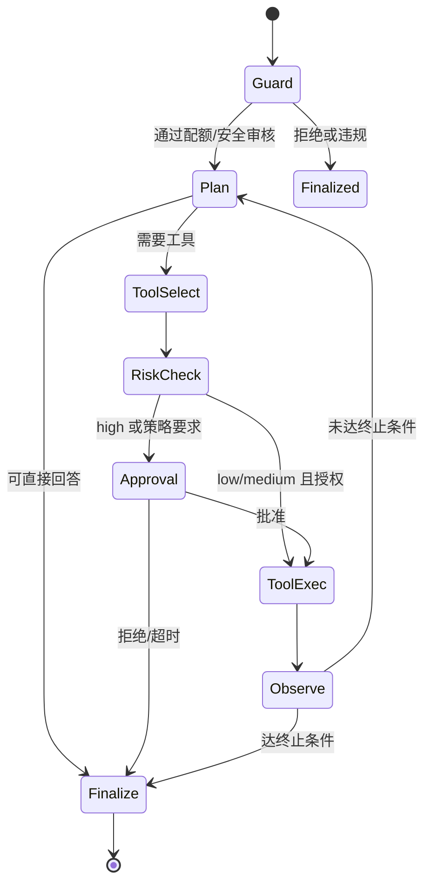

# LangGraph Agent 状态机与工具治理规范

> 约定企业生产环境下 Agent 的图结构、终止条件、工具风险分级与审批流。仅设计规范，不含代码。

## 1. 目标与原则

1. **默认安全**：未授权工具不可见；高危工具默认需人工审批  
2. **可终止**：步数、时间、重复调用均有硬上限  
3. **可审计**：每步写入 `agent_run_step`，关联 `request_id`  
4. **可中断**：支持 cancel 与 waiting_approval 恢复  
5. **最小权限**：工具凭据与租户/应用绑定，禁止越权数据源

---

## 2. 状态机（LangGraph 逻辑节点）



### 2.1 节点职责

| 节点 | 职责 | 副作用 |
|------|------|--------|
| **Guard** | 鉴权、租户配额、输入审核、加载 App/工具白名单 | 超限直接失败 |
| **Plan** | LLM 决策：直接答 / 调工具 / 结束 | 计入一步 |
| **ToolSelect** | 解析 tool_name + args，校验 JSON Schema | 非法参数失败本步 |
| **RiskCheck** | 查工具 `risk_level` 与 App 策略 | 分流审批或执行 |
| **Approval** | 持久化 `waiting_approval`，通知人工 | 阻塞至批准/拒绝/超时 |
| **ToolExec** | 执行 Adapter，强制超时与重试策略 | 写 step 出入参（脱敏） |
| **Observe** | 将工具结果压缩后写回对话状态 | 检测循环/重复 |
| **Finalize** | 生成最终回复、输出审核、usage 结算 | 关闭 run |

### 2.2 图状态（State）最小字段

| 字段 | 说明 |
|------|------|
| request_id / run_id / tenant_id / app_id / session_id | 关联 |
| messages | 对话与工具消息窗口 |
| step | 当前步号 |
| max_steps | 来自 App，默认 8，硬上限建议 ≤ 20 |
| pending_tool | 待审批工具调用 |
| citations / tool_traces | 汇总 |
| status | running / waiting_approval / succeeded / failed / cancelled |
| error | 结构化错误 |

---

## 3. 终止与熔断条件

任一满足则进入 **Finalize**（或失败结束）：

| 条件 | 默认 |
|------|------|
| 模型显式给出最终答案且无 tool_calls | 正常结束 |
| `step >= max_steps` | `AGENT_STEP_LIMIT` |
| 墙钟超时（整次 run） | 如 120s，可配 |
| 同一 tool + 相同参数连续成功/失败 ≥ N | N=2，防死循环 |
| 用户/系统 cancel | `cancelled` |
| 审批拒绝或审批超时 | 友好说明后结束 |
| 输出/输入安全审核拦截 | `FORBIDDEN` |

---

## 4. 工具治理

### 4.1 风险分级

| 级别 | 含义 | 示例 | 默认策略 |
|------|------|------|----------|
| **low** | 只读、无副作用 | 知识库检索、公开天气 | 自动执行 |
| **medium** | 读内部数据 | 订单查询、CRM 只读 | 自动执行 + 全量审计 |
| **high** | 写操作/外部通信/资金相关 | 下单、改库、发邮件、打款 | **必须审批** 或 App 显式关闭 |

### 4.2 注册要求（`tool_definition`）

必填：`name`、`description`（供 LLM）、`input_schema`、`tool_type`、`risk_level`、`config`（含超时 ms）、`status`。

建议规范：

- HTTP 工具：仅允许企业域名白名单；禁止任意 URL SSRF  
- SQL 工具：仅 `sql_readonly`；禁止 DDL/DML；行数/超时限制  
- 描述中写清「不要用于猜测 ID」等使用边界  
- 密钥不进 Schema，只引用密钥管理 ID

### 4.3 运行时鉴权顺序

```
App 是否绑定该 tool
 → 工具 status=enabled
 → 调用方 RBAC 是否具备 tool:invoke:{id}
 → allowlist（请求级可选收紧）
 → RiskCheck / Approval
 → 执行
```

任一失败：本步记 `TOOL_DENIED`，由 Plan 决定改答或结束（不得静默跳过审计）。

### 4.4 执行约束

| 项 | 建议默认 |
|----|----------|
| 单工具超时 | 10–30s |
| 重试 | 仅幂等 low/medium 读工具，最多 1 次 |
| 输出大小 | 截断至如 8KB 再回灌模型 |
| 并发 | 单 run 内默认串行工具调用（P0） |
| 脱敏 | 手机号、证件号、Key 出库前打码 |

---

## 5. 人工审批流

1. **RiskCheck** 判定需审批 → `agent_run.status = waiting_approval`  
2. 写入 step：`node=approve`，含 tool、args 摘要  
3. 通知渠道（企微/邮件/管理端待办）— 实现期可选  
4. `POST /agent/runs/{run_id}/approve`  
   - `decision=approve|reject`  
   - `approver`、`comment`  
5. 批准 → **ToolExec**；拒绝 → **Finalize**（说明原因）  
6. 审批超时（如 30min）→ 自动 reject

**权限**：仅具备 `agent:approve` 且同租户的人可批。

---

## 6. 与 RAG / Chat 的关系

| 模式 | 图是否启用 | 说明 |
|------|------------|------|
| 纯 Chat | 否 | Model Router 直出 |
| RAG | 可选 | 检索可作为 **low** 内置工具，或在 Chat 链路固定 RAG 管道 |
| Agent | 是 | 检索工具 + 业务工具组合；App 配置 `tool_ids` |

推荐：把「企业知识库检索」做成内置 low 工具 `kb_search`（底层走 Qdrant Adapter，强制 `tenant_id`/`kb_id` payload 过滤），与业务工具统一治理，避免两套路经。

---

## 7. Prompt 与模型策略（Agent）

- System Prompt 固定章节：角色、工具使用规则、禁止编造工具结果、步数意识  
- 工具列表仅注入**当前授权**工具的 name/description/schema  
- Plan 节点可用较强调模型；对工具结果摘要可用较小模型（成本优化，P1）  
- Fallback：Plan/Finalize 模型失败时按 App `fallback_model_id` 降级；工具执行失败不切换“假成功”

---

## 8. 可观测与审计字段

每次 run 至少记录：

- `request_id`, `run_id`, `tenant_id`, `app_id`
- 每步：`node`, `tool_id`, `latency_ms`, `status`
- 最终：`model_id`, tokens, `status`
- 审批：`approver`, `decision`, `comment`

对外查询：`GET /agent/runs/{run_id}`、`GET /traces/{request_id}`。

---

## 9. P0 / P1 范围

**P0**

- 单 Agent 图：Guard → Plan → Tool → Observe → Finalize  
- low/medium 自动执行；high 直接拒绝或未实现审批则禁用  
- max_steps、超时、审计  

**P1**

- Approval 节点与管理端待办  
- 循环检测、输出截断策略可配  
- 多工具并行（可选）  

**P2**

- 多 Agent 协作、子图  
- 与 Workflow UI 对接  

---

## 10. 合规检查清单（上线前）

- [ ] 生产关闭「任意 HTTP URL」类工具  
- [ ] 所有 high 工具已定审批人或保持 disabled  
- [ ] 检索与工具调用均带 tenant 隔离测试用例  
- [ ] 无 request_id 的 Agent 入口已拦截  
- [ ] 步数与超时压测下无资源泄漏（线程/连接）  
