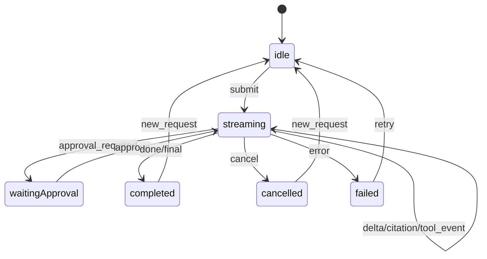

# 管理端页面设计

> 管理端为 React 18 + TypeScript + Vite 单页应用，UI 使用 Ant Design 5 与 Pro Components。接口契约见 [03-api-spec.md](./03-api-spec.md)；本文件只定义 P0/P1 的页面边界，不包含 Workflow 画布和业务侧聊天 UI。

## 1. 全局约定

### 1.1 路由与访问控制

- 登录成功后请求 `GET /auth/me`，将 `user_id`、`tenant_id`、`permissions` 存入全局客户端状态。
- 每个路由声明所需权限；无权限时不展示菜单，直接访问返回无权限页。
- 列表型页面使用 TanStack Query 管理查询、分页、筛选和失效刷新；登录态、菜单折叠与主题偏好使用 Zustand。
- API 客户端由 OpenAPI 生成；页面不得直接拼接 URL、定义重复 DTO 或读取服务端密钥。

### 1.2 全局状态与反馈

| 场景 | 前端行为 |
|------|----------|
| `UNAUTHORIZED` | 清除登录态并跳转 `/login` |
| `FORBIDDEN` | 展示无权限提示，不展示敏感字段 |
| `VALIDATION_ERROR` | 定位到表单字段；没有字段映射时展示通用错误 |
| `QUOTA_EXCEEDED` / `MODEL_UNAVAILABLE` | 保留用户输入，展示可重试状态 |
| 删除资源 | 二次确认；知识库删除必须显式传递 `confirm=true` |
| 异步任务 | 轮询任务或资源状态；终态为 `ready`、`failed`、`cancelled` 时停止 |

## 2. 信息架构与路由

| 一级菜单 | 路由 | 页面 | 阶段 | 权限 |
|----------|------|------|------|------|
| 无 | `/login` | 登录 | P0 | 匿名 |
| 工作台 | `/dashboard` | 概览 | P0 | 已登录 |
| 应用中心 | `/apps` | 应用列表 | P0 | `app:read` |
| 应用中心 | `/apps/new`、`/apps/:appId` | 应用配置 | P0 | `app:write` |
| 应用中心 | `/apps/:appId/playground` | 应用调试台（Chat/RAG） | P0 | `app:read` |
| 知识库 | `/knowledge-bases` | 知识库列表 | P0 | `kb:read` |
| 知识库 | `/knowledge-bases/new`、`/knowledge-bases/:kbId` | 知识库配置与文档 | P0 | `kb:write` |
| 知识库 | `/documents/:docId/chunks` | 切片浏览 | P0 | `kb:read` |
| 知识库 | `/knowledge-bases/:kbId/search` | 检索调试 | P0 | `kb:read` |
| 模型与 Prompt | `/models`、`/models/new`、`/models/:modelId` | 模型管理 | P0 | `model:read` / `model:write` |
| 模型与 Prompt | `/prompts`、`/prompts/:promptId` | Prompt 管理 | P1 | `prompt:write` |
| 工具平台 | `/tools`、`/tools/new`、`/tools/:toolId` | 工具管理 | P1 | `tool:write` |
| Agent 运维 | `/agent-runs`、`/agent-runs/:runId` | 运行记录与详情 | P1 | `audit:read` |
| Agent 运维 | `/approvals` | 审批待办 | P1 | `agent:approve` |
| 观测审计 | `/traces` | 调用追踪 | P0 | `audit:read` |
| 观测审计 | `/audit-logs` | 审计日志 | P0 | `audit:read` |
| 治理中心 | `/tenants`、`/tenants/:tenantId` | 租户与配额 | P0 / P1 | 平台管理员 |
| 治理中心 | `/api-credentials` | API 凭证 | P0 | 租户管理员 |
| 治理中心 | `/users`、`/roles` | 用户、角色与 ACL | P1 | 租户管理员 |
| 系统运维 | `/system/health` | 健康检查 | P0 | 平台运维 |

## 3. P0 页面

### 3.1 登录与工作台

| 页面 | 核心内容 | 接口 | 关键交互 |
|------|----------|------|----------|
| 登录 | 账号、密码 | `POST /auth/login`、`GET /auth/me` | 登录成功后按权限跳转首个可访问页面 |
| 概览 | 配额、近 24 小时调用/失败、文档状态统计 | `GET /dashboard/overview` | 卡片跳转应用、文档或审计页面；P1 扩展待审批数量 |

### 3.2 应用中心

**应用列表**：表格展示名称、状态、主模型、关联知识库数、更新时间；支持 `keyword`、`status` 筛选和分页。操作为创建、编辑、调试、删除/停用，对应 `GET/POST /apps`、`GET/PATCH/DELETE /apps/{app_id}`。

**应用配置**：采用分组表单，保存前执行跨字段校验。

| 分组 | 字段 | 数据来源/约束 |
|------|------|---------------|
| 基础 | 名称、状态 | `GET/PATCH /apps/{app_id}` |
| 模型 | 主 Chat 模型、超时 | `GET /models?model_type=chat`；不配置备用模型 |
| 知识库 | 知识库、多选权重 | `GET /knowledge-bases`；embedding 与维度由知识库决定 |
| RAG | top_k、recall_n、rerank、Rerank 模型 | 仅 Rerank 模型可选 |
| Prompt | Prompt 与已发布版本 | P1 前不显示此分组 |
| 工具与 Agent | tool_ids、max_steps、high 审批策略 | P1 前不显示此分组 |
| 安全 | 输入/输出审核开关 | 保存至 `safety_policy` |

**应用调试台**：P0 可选择 Chat 或 RAG 模式；P1 才开放 Agent 模式。提交后使用 Fetch + ReadableStream 消费 SSE。左侧为会话历史，右侧展示回答、引用、工具轨迹与请求追踪链接。

`citation` 追加引用卡片，`usage` 更新用量，`error` 终止流并保留已生成内容。Agent 状态为 `waiting_approval` 时跳转 P1 审批详情；取消调用 `POST /agent/runs/{run_id}/cancel`。

### 3.3 知识库

| 页面 | 核心内容 | 接口与状态 |
|------|----------|------------|
| 知识库列表 | 名称、embedding 模型、维度、文档数、状态；创建/删除 | `GET/POST /knowledge-bases`；删除确认后调用 `DELETE ...?confirm=true` |
| 知识库配置 | 元数据、chunk_size、chunk_overlap | `GET/PATCH /knowledge-bases/{kb_id}`；dimension、embedding 模型和 vector_store 创建后只读 |
| 文档管理 | 文件上传、文本入库、状态、重建、删除 | 文档状态：`pending → processing → ready/failed`；处理期间轮询文档或 ingest job |
| 切片浏览 | ordinal、内容、Token 估算、页码/标题路径 | `GET /documents/{doc_id}/chunks`、`GET /chunks/{chunk_id}` |
| 检索调试 | 查询文本、top_k、rerank、命中切片与分数 | `POST /rag/search`；不调用生成模型 |

上传使用 `multipart/form-data` 的 `file` 字段；文本入库单独使用 JSON 接口。文档失败时显示 `error_message`，重试仅调用 `POST /documents/{doc_id}/reindex`。

### 3.4 模型、观测与治理

| 页面 | 核心内容 | 接口 |
|------|----------|------|
| 模型管理 | Chat、Embedding、Rerank 的列表、创建、编辑、连通性测试与删除 | `/models`、`/models/{model_id}`、`/models/{model_id}/test` |
| 调用追踪 | 输入 request_id 查询模型、检索、工具、Token、耗时 | `GET /traces/{request_id}` |
| 审计日志 | 时间、应用、用户、request_id、action 筛选 | `GET /audit/logs` |
| 租户管理 | 租户列表、创建、名称/状态更新 | `/tenants`、`/tenants/{tenant_id}` |
| API 凭证 | 名称、scope、状态、过期时间；创建、吊销 | `/api-credentials`；新密钥只在创建成功弹窗显示一次 |
| 系统健康 | MySQL、Redis、Qdrant 就绪状态 | `GET /health`、`GET /ready` |

模型密钥在编辑页仅允许覆盖填写，列表和详情绝不显示明文。Embedding 模型必填 dimension；Rerank 模型禁止填写 dimension。

## 4. P1 页面

| 页面 | 核心内容 | 接口 | 关键状态 |
|------|----------|------|----------|
| Prompt 管理 | 模板列表、草稿版本、变量 Schema、发布 | `/prompts`、`/prompts/{id}/versions`、`/publish` | `draft`、`published` |
| 工具管理 | HTTP/只读 SQL/RPC/retriever、Schema、超时、启停 | `/tools`、`/tools/{id}` | `enabled`、`disabled`；`low/medium/high` |
| Agent 运行 | 条件筛选、步骤轨迹、脱敏工具入参/出参 | `/agent/runs`、`/agent/runs/{id}` | `running`、`waiting_approval`、`succeeded`、`failed`、`cancelled` |
| 审批待办 | 待审批工具摘要、批准/拒绝、意见 | `/agent/runs/pending-approvals`、`/approve` | 仅 `waiting_approval` 可操作；超时后只读 |
| 配额 | RPM、日 Token、月预算及实际用量 | `GET/PUT /tenants/{id}/quota` | 实时窗口值与日快照分开展示 |
| 用户、角色、ACL | 用户状态、角色权限、知识库授权主体 | `/users`、`/roles`、`/knowledge-bases/{id}/acl` | 变更后刷新当前权限 |

## 5. 不在页面范围

- P2 Workflow 画布、评测与回归。
- 面向终端用户的嵌入式 Chat 页面；业务方通过 API 或 SDK 接入。
- 模型、对象存储、向量库等基础设施部署控制台。
