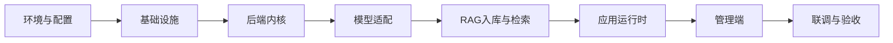

# P0 平台建立步骤

> 目标是在不建设 Tool 平台、Agent 审批、Prompt 完整版本管理与 Workflow 的前提下，交付可管理模型和知识库、可配置应用、可流式对话与 RAG、可审计的企业 AI 平台最小闭环。

## 1. 建立顺序

每一步完成验收后再进入下一步。禁止先做页面而没有稳定接口契约，或在没有租户过滤的情况下接入向量检索。

## 2. 步骤一：环境与配置规范

**输入**：已确认的技术栈与服务地址规划。

**工作项**：

1. 固化 Python 3.11+、Node.js LTS、Docker Compose 版本。
2. 初始化后端与 `apps/admin` 前端目录，前端使用 React 18、TypeScript、Vite、Ant Design。
3. 定义环境变量分层：本地开发 `.env`、部署环境变量或配置中心；密钥只由部署环境注入。
4. 定义配置项：MySQL、Redis、Qdrant、对象存储、队列、外部 Xinference 地址与模型 UID、JWT 签名密钥。
5. 提供不含真实密钥的 `.env.example`，禁止把 API Key、数据库密码写入代码或文档示例。
6. **运行方式**：后端与基础设施用 Docker Compose；管理端本机 `npm run dev`（前后端分离）。

**产出**：可启动的空工程、配置加载模块、环境变量模板、API Dockerfile。

**验收**：

- `docker compose up` 后 API `/health` 可用；管理端本机 npm 可启动并代理到 API。
- 缺少必填配置时服务启动直接失败并指出配置项。
- 任意仓库文件中不包含真实密码、Token 或模型 API Key。

## 3. 步骤二：基础设施

**输入**：步骤一的配置项与网络规划。

**工作项**：

1. 使用 Docker Compose 启动 MySQL 8+、Redis、Qdrant、对象存储与选定的异步队列。
2. 创建 `ai_platform` 数据库，按 [04-data-model.md](./04-data-model.md) 建立 P0 所需表及索引。
3. 接通对象存储桶，限定文档对象前缀为 `tenant_id/kb_id/doc_id`。
4. 接通外部 Xinference；本平台只保存地址与 `model_uid`，不部署或托管模型进程。
5. 实现对 MySQL、Redis、Qdrant 的 `GET /ready` 探测。

**产出**：可重复启动的本地基础设施与依赖健康检查。

**验收**：

- `/health` 返回服务存活，`/ready` 正确列出每项依赖状态。
- 后端可完成 MySQL、Redis、Qdrant、对象存储的连接验证。
- Qdrant Collection 创建时记录知识库维度，维度不可原地变更。

## 4. 步骤三：后端内核与治理

**输入**：基础设施已就绪，数据表可访问。

**工作项**：

1. 建立 FastAPI 分层：API、领域服务、Adapter、基础设施与治理模块。
2. 实现 `X-Request-Id` 生成/透传、统一错误体、分页参数校验与结构化审计。
3. 实现 JWT 管理端登录和 API 凭证鉴权；解析出可信的 `tenant_id`、`user_id` 与权限集合。
4. 所有租户资源查询默认带 `tenant_id` 条件；禁止客户端传入的 tenant_id 覆盖凭证上下文。
5. 实现 P0 权限点：`model:read/write`、`kb:read/write`、`app:read/write`、`audit:read`。

**产出**：认证、权限、错误处理、审计和基础 CRUD 框架。

**验收**：

- 未认证请求返回 `UNAUTHORIZED`，越权请求返回 `FORBIDDEN`。
- 同一资源 ID 在不同租户凭证下不可读取、更新或删除。
- 所有业务请求可通过 `request_id` 找到对应审计记录。

## 5. 步骤四：模型配置与 Adapter

**输入**：后端内核和外部 Xinference 地址。

**工作项**：

1. 实现模型配置 CRUD 与连通性检测，密钥加密保存，查询接口只返回脱敏信息。
2. 实现 OpenAI 兼容 Chat Adapter，按 App 选择 Chat 模型。
3. 实现 OpenAI 兼容 Embedding Adapter，连接外部 Xinference 的 bge-m3。
4. 建立模型类型校验：Embedding 必须有 dimension；Rerank 不填写 dimension；Chat、Embedding、Rerank 禁止混用。
5. 实现 `/models/{model_id}/test`，返回耗时、模型类型与可读错误原因。

**产出**：可被知识库和应用引用的模型配置。

**验收**：

- Chat 模型可完成最小非流式请求。
- bge-m3 返回的实际向量维度与保存的知识库维度一致。
- 模型密钥不会出现在列表、详情、日志、错误体或审计载荷中。

## 6. 步骤五：知识库与 RAG

**输入**：Embedding Adapter、对象存储、队列、Qdrant。

**工作项**：

1. 实现知识库创建，绑定 `embedding_model_id`、dimension、Qdrant Collection、分块参数。
2. 实现文件上传和文本入库，创建 `document` 与 `ingest_job` 后异步返回。
3. 实现异步任务：解析、分块、Embedding、写入 Qdrant、更新文档与任务状态。
4. 实现文档状态机：`pending → processing → ready/failed`；失败保留可读的 `error_message`。
5. 实现 `POST /rag/search` 与 `POST /rag/query`；检索必须添加 `tenant_id + kb_id` payload 过滤。
6. 实现切片浏览、文档重建、文档删除及向量级联删除。

**产出**：从上传文档到检索命中的 RAG 闭环。

**验收**：

- 文档上传后可观察到任务和文档状态最终进入 `ready` 或 `failed`。
- 删除文档后其 Qdrant 向量不再能被检索到。
- 跨租户、跨知识库检索均无法命中非授权切片。
- `rag/search` 返回 chunk、分数、来源与内容；`rag/query` 返回 answer 与 citations。

## 7. 步骤六：应用运行时与可观测

**输入**：模型配置与 RAG 可用。

**工作项**：

1. 实现 App CRUD，保存主 Chat 模型、知识库关联、RAG 参数与安全策略。
2. 实现 `POST /chat/completions`，支持新建/继续会话、非流式响应与 SSE。
3. 统一 SSE 事件：`delta`、`citation`、`usage`、`error`、`done`，事件均带 `request_id`。
4. 写入会话、消息、`run_trace` 与审计记录；实现追踪和审计查询。
5. 实现配额读取、工作台汇总和文档导入任务查询。

**产出**：可通过 API 验证的 Chat/RAG 应用最小闭环。

**验收**：

- App 可绑定知识库并在对话中返回引用。
- 流式连接可增量返回、异常时发送 `error`、完成时发送 `done`。
- `GET /traces/{request_id}` 能关联模型、Token、检索命中、耗时与最终状态。

## 8. 步骤七：React 管理端

**输入**：P0 API 已稳定，OpenAPI 可生成 TypeScript 客户端。

**工作项**：

1. 初始化 React 管理端，接入 React Router、TanStack Query、Zustand 与 Ant Design。
2. 实现登录、当前用户加载、权限路由与全局错误处理。
3. 生成 API 类型与客户端，页面禁止自行定义与后端重复的请求/响应结构。
4. 依次实现：工作台、模型管理、知识库与文档、应用列表/配置/调试台、调用追踪、审计日志、API 凭证、租户和健康检查。
5. 调试台使用 Fetch + ReadableStream 消费 SSE，支持取消请求、引用展示和 request_id 跳转追踪。

页面范围、路由和交互状态以 [06-admin-pages.md](./06-admin-pages.md) 为准。

**验收**：

- 菜单和路由均受权限控制，直接访问无权限路由显示无权限页。
- 管理端可完整完成模型登记、知识库入库、应用配置、RAG 调试与调用追踪。
- 创建 API 凭证时密钥仅展示一次，刷新页面后不可恢复。

## 9. 步骤八：联调、验收与部署

**输入**：前后端 P0 页面和 API 均可运行。

**工作项**：

1. 完成浏览器到 SSE、上传、异步任务、追踪和审计的端到端联调。
2. 验证身份认证、租户隔离、知识库过滤、密钥脱敏、删除级联、模型不可用与配额超限。
3. 接入日志、指标和健康检查；部署环境设置备份、恢复、对象存储生命周期与告警。
4. 部署后重新验证外部 Xinference 连通性和每个依赖服务的 ready 状态。

**P0 上线验收清单**：

- [ ] 管理端所有 P0 页面可用，P1 菜单和接口不对外开放。
- [ ] 所有请求有 request_id、审计记录和可查询追踪。
- [ ] Chat、RAG、文件上传、异步向量化与引用输出可端到端运行。
- [ ] 检索与数据库查询均强制租户隔离。
- [ ] 模型与 API 凭证密钥不在 API 响应、日志、审计或前端状态中泄露。
- [ ] MySQL、Redis、Qdrant 任一依赖不可用时 `/ready` 反映实际状态。

## 10. P0 边界

P0 不建设以下能力：

- Tool 注册与执行平台、Agent 运行与人工审批。
- Prompt 模板完整版本管理、用户/角色/知识库 ACL 管理页面、配额编辑页。
- 多向量库 Adapter、Rerank、复杂文档解析策略与多工具并行。
- Workflow 画布、评测回归、多 Agent 协作与业务侧嵌入式 Chat UI。

这些能力按 [02-architecture.md](./02-architecture.md) 和 [05-agent-governance.md](./05-agent-governance.md) 的 P1/P2 路线后续建设。
