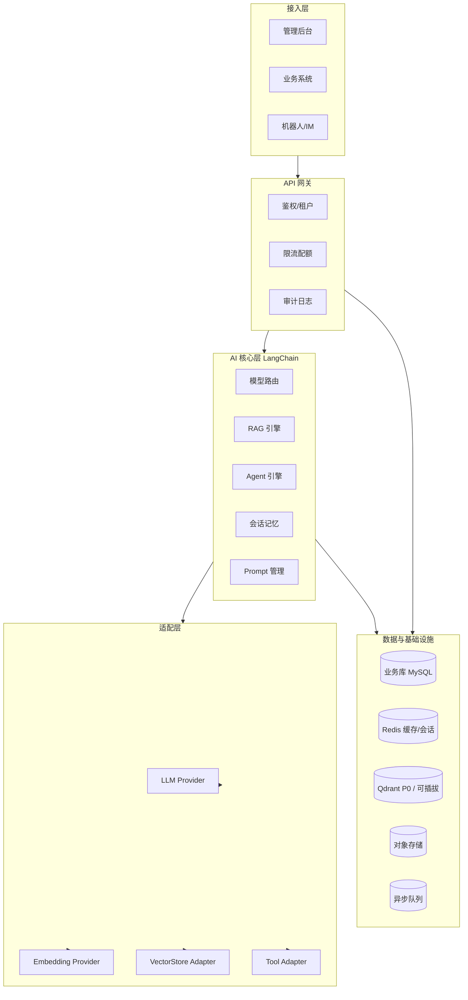

# 总体架构

> 目标：可自研的企业 AI 内核——统一模型调用、知识库 RAG、Agent/工具、多租户与治理；LangChain 做编排，自建企业层。

## 1. 定位与边界

**做什么**

- 统一多模型（云厂商 / 本地 Ollama）接入与路由
- 企业知识库 RAG（多向量库可插拔）
- Agent + Tool/Function Calling（对接内部系统）
- 会话、审计、配额、权限、可观测
- 通过 API / SDK 给业务系统调用

**不做什么（首期）**

- 不做完整低代码 Workflow 画布（P2）
- 不绑死某一家向量库或某一家模型
- 不替代现有业务中台，只提供 AI 能力层

## 2. 逻辑架构



核心理念：**业务只依赖稳定接口；模型、向量库、工具全部 Adapter 化。**

## 3. 分层与模块

### 3.1 接入层（前后端分离）

- OpenAPI：详见 [03-api-spec.md](./03-api-spec.md)；后端独立提供 `/api/v1`，不渲染页面
- 管理后台：`apps/admin` 为独立 SPA（React 18 + TypeScript + Vite + Ant Design），仅通过 HTTP/SSE 调用 API
- 本地开发：Vite 代理 `/api` → FastAPI；生产由 Nginx/网关分别托管静态资源与 API
- 管理后台通过 OpenAPI 生成类型安全的 API 客户端；流式 Chat 使用 Fetch 消费 SSE
- SDK：内部服务封装鉴权与流式调用

### 3.2 治理层

- **多租户**：`tenant_id` 贯穿会话、知识库、配额
- **RBAC**：配模型 / 读知识库 / 调工具分权
- **密钥管理**：API Key 加密存储，运行时注入 Provider
- **配额与限流**：按租户/应用/用户：RPM、Token、费用预算
- **审计**：提问、命中文档、工具调用、模型与 Token（脱敏）
- **内容安全**：输入输出审核钩子（可插拔）

### 3.3 AI 核心层

| 模块 | 职责 |
|------|------|
| Model Router | 主备、降级、按任务分流 |
| Prompt Hub | 版本化 Prompt、变量、A/B |
| Memory | 短期窗口 + 可选长期摘要；按 session/user 隔离 |
| RAG Engine | 解析 → 分块 → Embedding → 入库 → 检索 → 重排 → 生成 |
| Agent Engine | LangGraph 状态机；详见 [05-agent-governance.md](./05-agent-governance.md) |
| Observability | LangSmith / OpenTelemetry：链路、延迟、Token、失败原因 |

### 3.4 适配层

- **LLM（Chat）**：**自有链接**——按 App 配置对方的 `base_url` / `api_key` / `model`（OpenAI 兼容优先）；不托管、不锁定具体 Chat 型号
- **Embedding**：**bge-m3**（外部 Xinference，按 `base_url` + `model_uid` 连接）；与 LLM 分离；维度写入知识库元数据（P0 用 dense）
- **Rerank**：**bge-reranker-v2-m3**（同上，外部 Xinference）；召回后精排再交给生成
- **VectorStore**：`upsert / similarity_search / delete_by_doc`；**P0 实现为 Qdrant**
- **Document Loader**：PDF / Word / HTML / Markdown / 网页
- **Tool**：HTTP API、只读 SQL、内部 RPC、检索工具；统一鉴权与超时

## 4. 核心领域模型

- **Tenant** 租户
- **App** AI 应用（模型策略、知识库、工具集、Prompt）
- **ModelConfig** 模型供应商与密钥
- **KnowledgeBase** 知识库（embedding、维度、向量库实例）
- **Document / Chunk** 文档与切片
- **Session / Message** 会话与消息
- **ToolDefinition** 工具定义与权限
- **RunTrace** 一次调用完整追踪

应用运行时逻辑结构：

```
App
 ├─ chat_model_policy (primary / fallback)
 ├─ knowledge_bases[]
 ├─ tools[]
 ├─ prompt_version
 ├─ rag_top_k / rerank
 └─ safety_policy
```

表结构详见 [04-data-model.md](./04-data-model.md)。

## 5. 关键链路

### 5.1 纯对话

鉴权 → App 配置 → Memory → Prompt → Model Router → 流式返回 → Token/审计

### 5.2 RAG

**入库（异步）**：上传 OSS → MQ → 解析分块 → Embedding → 写向量库 → 更新状态  

**查询**：问题归一 → **bge-m3** Embedding → Qdrant 权限过滤召回 → **bge-reranker-v2-m3** 精排 → 上下文压缩 → LLM → 答案 + 引用

### 5.3 Agent

意图进入 LangGraph → Thought/Tool/Observe → RBAC 校验工具 → 终止或人工审批 → 汇总回复  

约束：最大步数、工具超时、高危默认关闭、全链路审计。

## 6. 非功能要求

- **高可用**：模型主备与熔断；向量库与业务库分离；API 无状态水平扩展
- **异步**：文档向量化走队列
- **缓存**：检索/Embedding 短 TTL 可选
- **安全**：检索必带 tenant/kb 过滤；工具最小权限；PII 脱敏
- **成本**：按 App 记 Token；贵模型可仅用于最终回答
- **可观测**：`request_id` 关联模型、命中、工具、耗时、费用

## 7. 逻辑目录

```
script-workshop/
  apps/api
  apps/admin                 # React 18 + TypeScript + Vite 管理后台
  framework/agent_apps        # 框架运行时
  framework/core
  framework/adapters
  framework/domain
  framework/infra
  framework/governance
  framework/design/          # 框架设计备忘
  docs/                      # 仅业务文档
```

## 8. 与 LangChat 对照

| 能力 | LangChat | 本框架 |
|------|----------|--------|
| 管理后台 | 现成 | 可自建或二期 |
| 模型调用 | 有 | LangChain 统一 |
| 向量库 | 主推 PgVector | Adapter 多选（**P0=Qdrant**） |
| Agent/工具 | 有 | LangGraph 强化编排与治理 |
| 多租户/审计 | 产品内置 | 一等公民 |
| 定制深度 | 改产品源码 | 自有内核 |

## 9. 分阶段路线

**P0**

- 多模型 Router + 流式 Chat
- Qdrant Adapter
- 基础 RAG + 引用
- 租户 / API Key / 审计 / Token 统计

**P1**

- 多向量库、Rerank、文档异步管道
- Tool 平台 + RBAC
- Prompt 版本发布
- 限流配额、主备降级

**P2**

- 多 Agent / 审批节点
- 评测与回归
- 可选 Workflow UI

## 10. 设计原则

1. Provider 可替换，业务禁止直依赖厂商 SDK  
2. 维度强约束，变更重建索引  
3. 检索必带权限过滤  
4. Agent 默认安全（白名单、步数上限、高危审批）  
5. 无 `request_id` 不得进生产  
