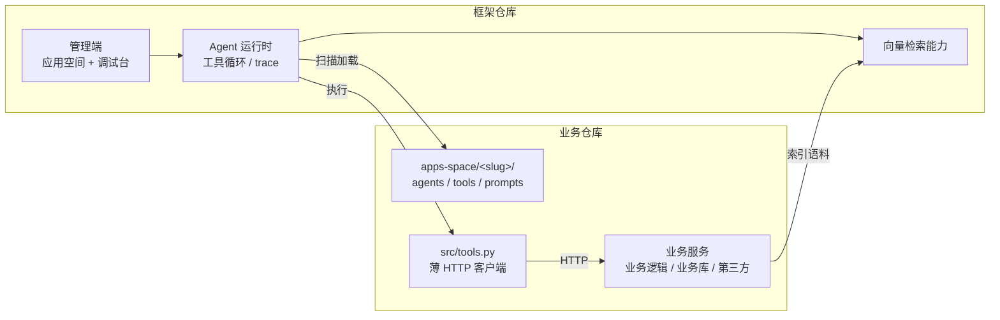

# Agent 框架定位与框架/业务分层改造

> 本文修订项目定位：从「企业 AI 平台产品」收敛为「**Agent 开发框架**」。框架只提供 Agent 运行时与调试能力，业务层通过独立仓库与 HTTP 服务接入。本文为设计文档，不含实现。
>
> 本文的决策**优先于** [06-admin-pages.md](./06-admin-pages.md) 与 [07-p0-build-steps.md](./07-p0-build-steps.md) 中冲突的部分，冲突清单见第 7 节。

## 1. 现状诊断

改造前必须承认一件事：**当前代码还不是 Agent 框架**。

| 现象 | 位置 | 说明 |
|------|------|------|
| 工具从未被执行 | `framework/governance/agent_workspace_service.py` | `entrypoint` 只在扫描时校验文件存在，从未被 `importlib` 加载 |
| 没有工具调用循环 | `framework/governance/chat_service.py` | 调 LLM 时不传 `tools`，单轮返回 |
| 多 Agent 是元数据 | `app.extra.collaboration_mode` | 值为 `multi_agent_react`，但没有任何调度代码 |
| specialist Agent 装饰性 | `apps-space/script-workshop/agents/` | coordinator 声明了全部 5 个工具，4 个 specialist 的 prompt 无人读取 |
| 检索无条件注入 | `chat_service.prepare_completion` | 绑定知识库后每轮强制检索，与工具化路线冲突 |
| 多知识库绑定是假的 | `kb_service.rag_search` | 只取 `kb_ids[0]`；`app_knowledge_base.weight` 从未被读取 |
| rerank 配置空转 | `app.rag_rerank` / `extra.rerank_model_id` | 可存可读，检索链从未调用 rerank |

结论：**调试台目前调试的是一个套了 system prompt 的聊天框，不是 Agent**。补齐工具执行循环是框架成立的前提，其余问题都排在它之后。

## 2. 新定位与边界

**框架做什么**

- Agent 定义的加载与校验（文件驱动）
- 工具注册与执行（ReAct 循环、步数与超时约束）
- 多 Agent 协作调度
- 运行轨迹（trace）记录与可视化调试
- 向量检索能力（embedding、切片、检索、rerank）
- 通过 API / SDK 供业务层调用

**框架不做什么**

- 不做知识库、模型、租户、权限的产品化管理界面
- 不承载任何业务逻辑与业务数据模型
- 不托管业务依赖（业务的第三方 SDK、数据库驱动不进框架镜像）
- 不做 Workflow 画布

## 3. 框架与业务层的职责切分



### 3.1 交界面

框架与业务层之间只有三个契约，任何一方都不得绕过：

| 契约 | 方向 | 内容 |
|------|------|------|
| **apps-space 目录约定** | 业务 → 框架 | Agent、工具、Prompt 的声明格式；框架按约定扫描 |
| **工具函数签名** | 框架 → 业务 | 框架按 `entrypoint` 加载并调用 Python 函数，入参由 JSON Schema 约束 |
| **HTTP / SSE API** | 框架 → 业务 | 业务系统触发 Agent 运行、索引语料、读取 trace |

### 3.2 物理分离方式

框架通过 `AGENT_WORKSPACE_ROOT` 配置定位应用空间根目录：

```
业务仓库/
  apps-space/<slug>/        # 部署时挂载进框架容器，AGENT_WORKSPACE_ROOT 指向此处
    app.yaml
    agents/<agent-id>/
    tools/*.yaml
    src/tools.py            # 只发 HTTP，不含业务逻辑、不引重依赖
  service/                  # 业务真身：独立进程，自管依赖与数据库
```

框架仓库内的 `apps-space/` 只保留**验证样本（fixture）**，用于自检工具循环与多 Agent 拓扑，不承载真实业务：

- `business-assistant` —— 单 Agent + 单工具，`get_business_status` 有真实返回值，是工具循环的验收用例
- `script-workshop` —— 多 Agent 拓扑样本。其 `src/tools.py` 全部抛 `NotImplementedError`，**禁止用于功能验收**（异常路径会掩盖循环自身的缺陷）

`docs/business-script-material/` 属于业务层领域设计，不是框架交付物；真实剧本业务落地时随业务仓库迁出。

### 3.3 为什么业务工具必须是薄 HTTP 客户端

若业务工具在框架进程内直接实现业务逻辑，业务的第三方 SDK、数据库驱动、对象存储客户端都要装进框架镜像，框架与业务重新耦合，「业务层拉取使用」不成立。

因此约定：`src/tools.py` 中的函数只做参数透传与 HTTP 调用，业务逻辑一律在业务服务内。框架容器只需具备发起 HTTP 请求的能力。

## 4. 目标形态

### 4.1 唯一编辑入口

**在 `apps-space` 编辑文件即完成应用开发。** 不需要在任何页面创建记录、复制 ID 或点击同步按钮。

### 4.2 管理端页面

只保留 3 个页面 + 登录：

| 路由 | 页面 | 职责 |
|------|------|------|
| `/login` | 登录 | `APP_ENV=dev` 免密 |
| `/apps` | 应用空间列表 | 列出扫描到的空间、加载状态、校验错误 |
| `/apps/:slug` | 应用空间详情 | Agent 拓扑、工具清单、Prompt（点击展开） |
| `/apps/:slug/playground` | 调试台 | 对话 + 运行轨迹逐步渲染 |

移除：工作台、知识库、模型管理、调用追踪、API 凭证、系统健康。

其中调用追踪不是取消，而是**并入调试台**——运行轨迹是调试的一部分，拆成独立菜单会割裂排查动作。系统健康由 `GET /api/v1/health` 直接提供，不值得占用页面。

### 4.3 运行时结构

```
请求 → 加载空间（内存注册表）→ 取 coordinator 的 system prompt 与工具集
     → LLM(tools) → tool_calls? → importlib 调用 → role=tool 追加 → 回到 LLM
     → 无 tool_calls 或触达 max_steps → 汇总回复
     → 每步写 trace 并以 SSE event: step 推给调试台
```

## 5. 关键决策

### D1 apps-space 的 YAML 不引用任何数据库生成的 ID

只要 YAML 里出现数据库生成的 ID，「只需编辑 apps-space」就不成立——使用者必须先去某个页面建记录、抄 ID 回来，而且 YAML 跨环境不可移植。

因此：

| 原写法 | 新写法 | 定义位置 |
|--------|--------|----------|
| `model.primary_model_id: mdl_ark_llm_001` | `model.primary: default` | `.env` / 配置文件定义模型连接 |
| `knowledge_bases: [kb_xxx]` | 由调用方运行时传 namespace | 业务层决定命名空间 |

### D2 应用空间以文件为唯一真源，不落库

`agent_workspace` / `agent_member` / `agent_prompt` / `agent_tool` 四张表本质是文件内容的副本。落库换来多实例共享与 SQL 查询，代价是副本同步——`file_digest`、`load_status`、`validation_error`、`loaded_at` 四个字段全部在管这个同步问题，并把负担转给使用者：每次改 YAML 都要回页面点「重新加载空间」。

改为**进程内注册表 + 启动时全量扫描 + 按 mtime 热重载**：

- 四张表删除，校验状态与错误变为内存状态，管理端读取内存快照
- 开发体验变为「改 YAML → 刷新页面生效」
- `app` 表在 D1 落地后同样可去掉，派生 ID `app_ws_{sha1(slug)[:20]}` 消失，**统一以 slug 作为唯一标识**（消除当前列表用 `app_id`、详情用 `slug`、调试台又用 `app_id` 的混用）
- MySQL 只保留真正需要持久化的内容：运行轨迹与会话历史

**代价**：多 worker 部署时各自扫描（挂载相同目录，结果一致，不构成问题）；热重载采用 mtime 轮询，不引入 watchdog 依赖。

### D3 工具执行循环是框架的核心

新建 `framework/core/agent_runtime.py`，承担四件事：

1. **工具加载**：`importlib.util.spec_from_file_location` 从 `<workspace>/src/*.py` 加载，模块名加 slug 前缀避免多空间冲突；加载结果缓存，空间重载时失效
2. **schema 映射**：工具声明中的 `parameters` 已是标准 JSON Schema，直接作为 OpenAI `tools` 数组元素，不引入中间转换层
3. **循环主体**：`tool_calls` → 执行（`inspect.iscoroutinefunction` 区分 sync/async）→ `role=tool` 追加 → 重新调用 LLM，直到无 `tool_calls` 或触达 `max_steps`
4. **约束**：单工具超时、总步数上限、异常转为可读的 observation 而非中断整轮

**多 Agent 协作**采用 handoff 模式：每个 specialist 对 coordinator 暴露为一个虚拟工具（如 `delegate_to_parser`），与普通工具在同一循环内统一调度。此项排在单 Agent 循环跑通之后。

### D4 知识库降级为能力，namespace 由调用方决定

「只保留一个共享知识库」是错误的简化——所有语料混入同一 collection 后，隔离责任被转移给调用方，漏传一次过滤条件就串台。正确的维度不是数量而是**归属**：知识库不再是框架内的预建资产，而是一项带命名空间的能力。

**移除**：`POST/PATCH/DELETE /knowledge-bases`、`POST .../documents/text`、`app_knowledge_base` 表、空间加载器中的知识库绑定写入、`app.yaml` 的 `knowledge_bases` 字段、`KnowledgeBasesPage`，以及 `chat_service.prepare_completion` 中的无条件检索注入。

**新增/改造**：

- `knowledge_base` 表替换为 `vector_namespace(namespace, tenant_id, collection, dimension, chunk_count, updated_at)`
- collection 命名 `ns_{sha1(namespace)[:16]}`，payload 存 `tenant_id` + `namespace`，保持一个 namespace 一个 collection 的硬隔离（与 [01-stack-and-decisions.md](./01-stack-and-decisions.md) 第 3 节约束一致）
- embedding 模型不再逐库绑定，走全局配置（bge-m3 已锁定），维度在首次索引时落库
- `POST /api/v1/index`：业务层索引入口，收 namespace + 文本
- 检索改为多 namespace 并联召回 `recall_n` → bge-reranker-v2-m3 精排取 `top_k`，一并解决「只用第一个 kb」与「rerank 空转」
- 内置 `retrieve` 工具：检索作为显式工具调用，由 LLM 按需决定是否检索、用什么 query 检索
- `agent.yaml` 新增 `namespaces` 字段：声明该 Agent 可访问的命名空间白名单。该列表注入 `retrieve` 的 `namespace` 参数为 JSON Schema `enum`，运行时再校验一次。`retrieve` 与 `namespaces` 必须成对声明，缺一则空间加载失败

`namespaces` 不是冗余配置。若 namespace 是自由文本，模型只能从 system prompt 的自然语言描述里猜命名空间，猜错的表现是空召回而非报错——静默失败最难排查。改成枚举后，可访问范围由配置而非提示词决定，越权与拼错都在调用前被拦住。

检索的 rerank 同理不设降级：开启 rerank 后精排失败直接抛错，不退回向量分数排序，否则排序质量无声变差且无法察觉。

`retrieve` 同时是工具循环的第二个验收用例——不产生外部费用、可重复、结果可断言。

### D5 回归测试针对行为而非函数

框架被业务层依赖，必须具备回归能力，但需要断言的是**给定输入下的工具调用序列**，而非单个函数的返回值。D3 的 trace 表即为其数据基础：录一次正确运行作为基线，后续比对步骤序列。此项在 trace 落地后再设计，当前不实现。

## 6. 改造顺序

顺序原则：**先清地基，再建循环**。若先写工具循环，循环会对着 `agent_tool` 表取工具定义，之后转内存注册表时需重写，因此瘦身必须在前。

### 步骤一：瘦身

按风险从低到高分三批：

1. 删除 5 个页面、对应路由与菜单项（纯前端，可独立验证）
2. 模型配置化（D1）：`app.yaml` 改为逻辑名，连接参数由配置定义
3. 四张 agent_* 表转内存注册表 + 热重载（D2），统一 slug 标识

**验收**：删除 `app` 与 agent_* 表后服务可正常启动；修改任一 YAML 后刷新页面即生效，无需手动重载；应用空间详情与调试台功能不回退。

### 步骤二：工具执行循环

实现 D3 的 1~3 项，暂不含 handoff。

**验收**：`business-assistant` 的 `get_business_status` 被真实调用，返回值进入后续 LLM 上下文；超过 `max_steps` 时正常终止；工具抛异常时转为 observation 且不中断整轮。

### 步骤三：trace 与调试台

- 新表 `agent_run` + `agent_run_step`（`step_no` / `agent_id` / `type` / `tool_id` / `args_json` / `output_json` / `duration_ms` / `error`）
- SSE 在既有 `citation` 旁新增 `event: step`，循环每推进一步即推送
- 调试台以时间线渲染：思考文本、工具名与入参、返回值与耗时、错误

**验收**：一次带工具调用的对话在调试台可见完整步骤；刷新后可按 run 查询历史轨迹。

### 步骤四：知识库 namespace 化与 retrieve 工具

实现 D4 全部内容。

**验收**：业务层可通过 `POST /api/v1/index` 索引到指定 namespace；Agent 声明 `retrieve` 与 `namespaces` 后能按需检索；模型无法访问未声明的 namespace；跨 namespace 无法互相命中；rerank 前后分数变化可在调试台观察。

### 步骤五（后续）：多 Agent handoff

specialist 以虚拟工具形式暴露给 coordinator，使 `script-workshop` 的 4 个 specialist 真正参与调度。

## 7. 对既有文档的修订声明

| 文档 | 失效内容 | 替代 |
|------|----------|------|
| [06-admin-pages.md](./06-admin-pages.md) 第 2 节 | 全部一级菜单与路由表 | 本文 4.2 节 |
| [06-admin-pages.md](./06-admin-pages.md) 3.2 应用配置 | 页面表单创建/配置应用 | 文件驱动，无配置表单 |
| [06-admin-pages.md](./06-admin-pages.md) 3.3 知识库 | 知识库列表/配置/文档/切片/检索页 | 全部移除，见 D4 |
| [06-admin-pages.md](./06-admin-pages.md) 3.4 | 模型管理、租户、API 凭证、系统健康页 | 全部移除 |
| [07-p0-build-steps.md](./07-p0-build-steps.md) 步骤四 | 模型配置 CRUD 与连通性检测页 | 配置化，见 D1 |
| [07-p0-build-steps.md](./07-p0-build-steps.md) 步骤五 | 知识库创建、文档管理、切片浏览 | 能力化，见 D4 |
| [07-p0-build-steps.md](./07-p0-build-steps.md) 步骤六 | App CRUD | 文件驱动，见 D2 |
| [07-p0-build-steps.md](./07-p0-build-steps.md) 步骤七 | 8 个页面清单 | 本文 4.2 节 |
| [07-p0-build-steps.md](./07-p0-build-steps.md) 第 10 节 P0 边界 | 「不建设 Tool 执行平台、多 Agent 协作」 | 二者转为框架核心，见 D3 |
| [02-architecture.md](./02-architecture.md) 第 4 节 | `App` 绑定 `knowledge_bases[]` | 运行时传 namespace，见 D4 |

[01-stack-and-decisions.md](./01-stack-and-decisions.md) 的技术栈选型、外部 Xinference 约定、bge-m3 / bge-reranker-v2-m3 分工、Chat 自有链接策略**继续有效**。

## 8. 明确不做

- 知识库、模型、租户、权限的管理界面
- Workflow 画布
- 框架内实现任何业务逻辑或业务数据模型
- 为兼容旧结构保留双路径（如无条件检索注入与 `retrieve` 工具并存）
- 业务侧终端用户 Chat 界面
